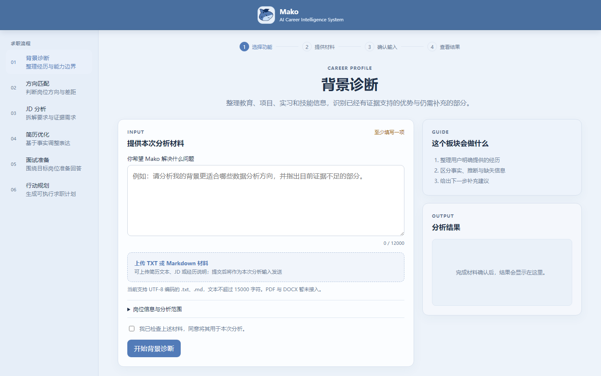

<p align="center">
  
</p>

<h1 align="center">Mako</h1>

<p align="center"><strong>AI Career Intelligence System</strong></p>

<p align="center">求职不是猜答案。先看清自己，再看清岗位。</p>

<p align="center">
  Mako 面向计划回国参加校招、实习或社会招聘的留学生，也服务国内应届生。<br>
  它把散落的个人经历、官方岗位要求、证据缺口和下一步行动，整理成一条能检查、能调整的求职路线。
</p>

<p align="center">
  <a href="#快速启动">快速启动</a> ·
  <a href="#从背景梳理到行动计划">查看求职流程</a> ·
  <a href="#工程实现">工程实现</a>
</p>

<p align="center">
  
  
  
</p>

## 求职信息很多，真正缺的是判断依据

准备回国求职时，招聘信息、经验分享和岗位清单并不难找。真正困难的是把这些信息与自己的经历对应起来：哪些岗位值得投入时间，现有材料能证明什么，还需要补充什么。

- 招聘页面开了很多，却不知道哪些岗位真正适合自己的背景；
- 海外课程、项目、实习和社团经历，很难直接对应国内企业的职责与门槛；
- 简历反复修改，却不清楚哪些内容有事实支撑，哪些关键证据仍然缺失；
- 面对投递、补经历、改简历和准备面试，很难判断下一步先做什么。

Mako 处理的不只是一份简历，而是求职过程中一连串相互关联的判断：先梳理已经发生并且可以说明的经历，再理解岗位要求，找出两者之间的对应关系和信息缺口，最后确定下一步行动。

## 认识 Finn

<p align="center">
  
</p>

<p><sub>Mako 的名字来自 Mako shark，是目前已知游速最快的鲨鱼，短时间内可达 74 公里/小时。流线的身体、深叉的尾鳍、尖细的吻部，都是为速度而生；更特别的是，它能让肌肉和大脑维持比周围海水更高的体温，因此在更冷的水域里依然能保持敏锐和爆发力。</sub></p>

<p><sub>求职也像一片水温不定、信号微弱的海域：机会常常藏在看不见的地方，能不能抓住，取决于谁先感知到，并快速适应。</sub></p>

<p><sub>Finn 是一只刚从校园游进职场的小鲨鱼，鳍尖还留着没褪干净的稚气，游动的时候还带着点不熟练的冲劲。面对陌生的岗位和选择，它也可能会感到茫然——但它的感官很灵，哪怕水浑光暗，也能捕捉到别人错过的一点点信号。它或许能陪着某一刻感到迷茫的你，一起游向那个真正适合自己的方向。</sub></p>

## 从背景梳理到行动计划

<p align="center">
  
</p>

这六项任务对应求职中经常连续出现的六个问题。用户可以从当前最需要的阶段开始，也可以基于同一份个人材料依次完成。

| 阶段 | 求职任务 | 这一阶段解决什么 |
|---|---|---|
| 1. 认识自己 | 背景诊断 | 梳理教育、项目、实习与技能，确认已有优势和仍需补充的信息 |
| 2. 找到方向 | 岗位方向匹配 | 比较不同岗位方向与当前经历，判断值得优先了解的范围 |
| 3. 看懂 JD | JD 分析 | 拆解职责、基本门槛、加分项和需要进一步确认的条件 |
| 4. 讲清经历 | 简历优化 | 在事实范围内调整表达，让相关经历准确回应目标岗位 |
| 5. 准备面试 | 面试准备 | 根据目标岗位准备笔试、面试、项目追问和经历复盘 |
| 6. 安排行动 | 行动规划 | 结合目标、差距和时间，安排投递、准备与能力补强 |

前一步形成的判断，会成为后一步的输入：岗位方向决定需要重点查看哪些 JD，JD 中的要求决定简历和面试应当准备哪些证据，尚未覆盖的要求则进入后续行动计划。

## 在工作台里开始

六项任务都可以从同一个工作台进入。选择当前要解决的问题后，用户可以直接输入情况，也可以上传 UTF-8 编码的 `.txt` 或 `.md` 材料；系统会先展示本次使用的内容，确认后再生成结果。

上传的文件文本只随本次请求处理，不作为知识文档导入。

进行岗位方向匹配时，可以选择系统内已经审核的岗位，也可以提供自己的完整 JD。系统岗位会展示经过审核的官方职责或要求；用户提供的链接仅用于标注来源，页面不会主动访问链接内容。



如果问题、经历、文件、JD 或岗位选项发生变化，工作台会要求重新确认材料，避免沿用已经过时的输入。结果可以复制、下载为 TXT，也可以保留当前输入后重试。当前页面尚未接入 PDF、DOCX、用户账户、管理界面或线上多人平台。

## 判断从哪里来

Mako 给出建议时，会同时说明使用了哪些材料、哪些结论已有证据支持，以及哪些地方仍然缺少信息。这样做的目的不是替用户下结论，而是让用户能够检查依据，再决定是否采纳。

- 简历与经历分析只使用用户提供的事实，不补写未提供的职责、技能、证书、数据或成果；
- 匹配结果分别呈现已有证据、信息缺口和适用范围，不用一个缺少解释的综合分数代替判断；
- 职位记录保留企业官方来源、内容版本和最近核验时间，便于回到原始信息核对；
- 官网内容暂时无法可靠解析时，只提供已登记的官方招聘入口，不将入口描述成具体在招职位；
- 用户可以选择职位信息的核验时间范围和来源，最终是否投递仍由用户决定。

## 项目当前进展

当前稳定版本为 v2.2.0。以下数据来自公开仓库与已发布版本的可验证状态。

| 项目 | 当前状态 |
|---|---:|
| 求职任务 | 6 项 |
| 企业官方来源 | 23 个 |
| 已审核结构化职位样本 | 35 个 |
| 正式版本 | v1.0.0 至 v2.2.0，共 13 个 |
| 公开回归测试 | 134/134 通过 |
| Docker 服务 | 5 个 |

## 快速启动

环境要求：Docker Desktop、Docker Compose v2，以及 Anthropic API Key 或支持 Anthropic 协议的兼容服务密钥。

```bash
cp .env.example .env
docker compose up -d --build
```

在本地 `.env` 中填写服务地址、模型名和 API Key，同时设置随机的 `REDIS_PASSWORD` 和至少 32 个字符的 `MAKO_ADMIN_API_KEY`。

启动后打开：

- `http://localhost/mako/`：Mako 求职工作台
- `http://localhost:8000/health`：应用健康状态

查看运行状态与停止服务：

```bash
docker compose ps
docker compose logs -f mako
docker compose down
```

完整环境准备和部署步骤见 [Mako 从 0 到 1 部署指南](Mako_从0到1部署指南.md)。

## 工程实现

Mako 的产品流程由 Agent、Skills、记忆、知识检索、职位数据治理和可观测性共同支撑。

| 模块 | 实现 |
|---|---|
| Agent | GeneralAgent、TechnicalAgent、CareerAgent |
| Skills | 6 个 Career Skills，另有 General 和 Technical Skill |
| 用户画像 | Structured CareerProfile、schema-guided extraction、conservative merge |
| 画像更新 | 只在检测到新增职业信息时异步更新 |
| 工作记忆 | Redis Working Memory |
| 长期记忆 | ChromaDB Episodic Memory 与跨会话画像复用 |
| 能力加载 | Dynamic SkillManager，按 Intent 注入单个 Career Skill |
| 知识检索 | RAG knowledge retrieval、文档版本与回滚 |
| 职位情报 | 23 家官方来源目录、JobPosting 标准化、审核、时效与用户来源选择 |
| V2 匹配 | 已审核 JD 要求、用户确认材料、逐项证据状态与请求级结果 |
| 可观测性 | `/monitor`、Prometheus、evaluation、模型请求与 token 用量指标 |
| 回答可靠性 | 完整性检测、一次有界续写和质量状态返回 |
| API 契约 | Request ID、幂等请求、结构化错误、职位来源和安全验证摘要 |
| 部署 | Nginx 外部入口、FastAPI、Docker Compose |

<details>
<summary>请求链路、CareerProfile 与 Skills 路由</summary>

```text
Nginx
  -> FastAPI POST /chat
  -> Redis Working Memory + ChromaDB
  -> 已选 Career Skill / IntentRecognizer 回退
  -> AgentOrchestrator
  -> GeneralAgent / TechnicalAgent / CareerAgent
  -> Dynamic SkillManager
  -> LLM response
  -> memory / CareerProfile / monitor / evaluation
```

工作台明确选择 Career Skill 时，请求直接进入对应任务；没有提供选择的 API 客户端继续使用自动意图识别。每次 Career 请求只注入一个与 Intent 对应的 Skill。本地知识上下文和 `/search` 直接查询现有知识库，不额外调用模型改写或重排查询。

CareerProfile 组织用户的教育、经历、技能和目标信息，只在检测到新增职业信息时异步更新。Redis 保存 Working Memory，ChromaDB 提供 Episodic Memory、画像复用与 RAG 检索。

方向匹配的 V2 请求级流程允许用户选择已审核职位、确认 JD 原文中的要求和关键词，并按已覆盖、部分覆盖、存在差距及待补充查看逐项结果。请求材料和结果不会写入证据库、CareerProfile、Redis、ChromaDB 或职位库。

</details>

<details>
<summary>官方职位数据治理</summary>

默认目录只收录能够确认企业归属的招聘网站，当前覆盖 23 家企业：

| 行业 | 企业 |
|---|---|
| 互联网与数字平台 | 腾讯、字节跳动、美团、百度、阿里巴巴 |
| 通信与智能硬件 | 华为、小米、OPPO、vivo、联想、中兴、大疆 |
| 汽车与新能源 | 比亚迪 |
| 金融 | 中国工商银行、招商银行 |
| 软件、云服务与企业软件 | Microsoft、SAP |
| 工业与智能制造 | Siemens |
| 消费品 | P&G、Unilever |
| 专业服务 | Deloitte、EY |
| 跨国金融服务 | HSBC |

每个来源记录官方招聘域名、入口、行业、招聘渠道、支持等级和核验日期。`GET /jobs/sources` 提供只读目录，并支持按行业和支持等级筛选；返回结果按“当前有已核验职位数据”和“当前仅提供官方招聘入口”汇总企业。

当前公开目录中，3 家企业有已核验的本地职位数据，20 家企业提供官方招聘入口。百度、SAP 和 Microsoft 是公开页面接入的代表性样本，用于验证解析、版本管理、审核和 CareerAgent 检索的完整链路。

```text
企业官方招聘站点
  -> 来源登记与安全检查
  -> 网络和内容安全检查
  -> 站点适配与 JobPosting 标准化
  -> 待审核版本
  -> SQLite 当前版本、历史与时效状态
  -> CareerAgent 按用户选择的核验窗口检索
  -> /chat 返回使用状态与官方来源
```

默认目录不包含社交平台、招聘聚合站、论坛或来源不明的网站。获取过程检查 HTTPS、允许域名、DNS 和实际连接地址、重定向、robots 规则、响应类型、内容大小及常见指令注入特征。来源进入目录不代表该站点已经具备自动分页或批量刷新能力，默认自动获取保持关闭。

`JobPosting` 记录企业、职位、地点、职责、要求、招聘类型、发布时间、有效期、更新时间和官方链接。新职位或发生变化的版本先进入待审核状态；内容哈希、审核结果和历史版本保存在 SQLite 中。受保护的批量接口一次最多导入或审核 50 条职位，并在写入或应用决定前完成整批校验。

职位按最近核验时间和官网有效期标记为 `fresh`、`aging`、`stale` 或 `expired`。`career_match` 和 `career_jd` 可以检索本地有效职位；`job_max_age_days` 允许用户为当前请求选择 1–90 天的核验窗口，默认 30 天，expired 职位始终排除。

`job_source_ids` 允许单次请求选择最多 5 个官方来源。`job_data_mode` 可以只使用本地已核验职位，也可以在数据不足时返回已登记的官方招聘入口。`job_data_used`、`job_sources`、`job_source_options` 等字段说明本次使用范围，这些选择不会写入 CareerProfile 或 Memory。

聊天过程中不会实时访问招聘网站。CareerAgent 读取已经验证并保存在本地的职位记录；无法可靠解析的页面保留旧数据或官方入口，不绕过登录、验证码或访问限制。

</details>

<details>
<summary>API 入口与调用示例</summary>

Swagger 默认关闭。本地需要接口文档时，可以在 `.env` 中设置：

```env
ENABLE_SWAGGER_UI=true
```

| 地址 | 用途 |
|---|---|
| `http://localhost/mako/` | Mako 求职工作台 |
| `http://localhost:8000/docs` | Swagger UI，需启用 `ENABLE_SWAGGER_UI` |
| `http://localhost:8000/health` | 应用健康和 Agent 统计 |
| `http://localhost:8000/skills` | Skill 加载摘要，需 `X-Admin-Key` |
| `http://localhost:8000/monitor` | 监控摘要，需 `X-Admin-Key` |
| `http://localhost:8000/search` | 本地知识检索 |
| `http://localhost:8000/jobs/sources` | 官方职位来源只读目录 |
| `http://localhost:9090` | Prometheus |

```bash
curl -X POST "http://localhost:8000/chat" \
  -H "Content-Type: application/json" \
  -d '{"user_id":"demo-user","job_max_age_days":30,"job_source_ids":["src_cn_tencent","src_cn_baidu"],"job_data_mode":"official_links_if_missing","message":"我准备回国求职，主修信息系统，有数据分析实习经历，适合关注哪些岗位？"}'
```

响应中的关键字段包括：

- `response`
- `intent`
- `agent_type`
- `review_required`
- `latency_ms`
- `knowledge_used`
- `job_data_used`
- `job_sources`
- `job_max_age_days`
- `job_source_ids`
- `job_data_mode`
- `job_source_options`
- `request_id`
- `response_complete`
- `continuation_used`
- `quality_flags`

当模型输出因 token 上限或结构未闭合而可能中断时，Mako 最多执行一次有界续写。调用方可以根据完整性和质量字段决定是否重试或转入人工检查。

</details>

<details>
<summary>验证、已知边界与安全边界</summary>

v2.2.0 公开候选完成了以下验证：

| 检查项 | 结果 |
|---|---|
| 公开基线回归 | 134/134 通过 |
| Python syntax / import | 通过 |
| Python 依赖审计 | 未发现已知漏洞 |
| Docker Compose config | 通过 |
| V2 请求级岗位匹配与权限边界 | 通过 |
| 六个工作台板块、双职位入口与失败恢复 | 通过 |
| 模型用量指标、幂等请求与 `/chat` 独立限流 | 通过 |

公开仓库的 CI 会运行公开基线回归、依赖审计、Python 编译检查、Compose 配置检查和凭据模式扫描。本地运行公开基线测试：

```powershell
.\.venv-win\Scripts\python.exe -m unittest discover -s tests -v
```

当前边界：

- 不同企业官网的数据呈现方式不同，未验证的站点不会启用自动分页或批量刷新；
- 职位信息反映最近一次成功核验的官网状态，投递前仍应打开返回的官方链接确认；
- `/chat` 和 `/search` 尚未提供终端用户身份系统，公网多用户部署还需要身份层与 TLS；
- `/chat` 的五分钟幂等缓存适用于当前单进程部署，多实例运行需要共享协调层；
- V2 工作台只对具备已审核结构化 JD 条目的系统岗位提供逐项状态，其他有效岗位和用户 JD 继续使用常规方向匹配；
- 请求级材料不会跨会话保存，PDF、DOCX、账户体系和跨设备恢复尚未开放。

v2.2.0 保持既有 API 路径、Redis key、ChromaDB collection、CareerProfile Schema 和知识登记库结构不变。Redis、ChromaDB、Prometheus、Nginx 与知识登记库继续使用现有 volume 名称和挂载路径。V2 使用独立的证据登记路径，普通工作台请求不会写入该登记库。

管理、调试、知识库、职位刷新和评测接口使用独立的 `X-Admin-Key`。应用、Redis、ChromaDB 和 Prometheus 的直连端口默认只绑定本机；外部招聘内容作为不可信事实背景处理，不能修改 Agent 身份、系统规则或工具权限。

</details>

<details>
<summary>目录结构</summary>

```text
agents/       Agent 实现与编排
api/          FastAPI 入口和 HTTP 路由
core/         Intent、CareerProfile、职位模型与 Skill 加载
memory/       Redis 与 ChromaDB 记忆层
skills/       动态业务规则
mcp/          工具管理、知识库和职位适配器
monitor/      运行监控
evaluation/   意图与对话评测
tests/        公开基线回归与安全边界测试
tools/        维护工具
ui/           求职工作台、交互脚本和品牌图标
```

</details>

## 项目文档

- [Mako 从 0 到 1 部署指南](Mako_从0到1部署指南.md)
- [Mako v2.2.0 发布说明](docs/releases/notes/v2.2.0.md)
- [Mako v2.1.0 发布说明](docs/releases/notes/v2.1.0.md)
- [Mako v2.0.0 发布说明](docs/releases/notes/v2.0.0.md)
- [Mako v1.9.0 发布说明](docs/releases/notes/v1.9.0.md)
- [Mako v1.8.0 发布说明](docs/releases/notes/v1.8.0.md)
- [Mako v1.7.0 发布说明](docs/releases/notes/v1.7.0.md)
- [Mako v1.6.0 发布说明](docs/releases/notes/v1.6.0.md)
- [Mako v1.5.0 发布说明](docs/releases/notes/v1.5.0.md)
- [Mako v1.4.0 发布说明](docs/releases/notes/v1.4.0.md)
- [Mako v1.3.0 发布说明](docs/releases/notes/v1.3.0.md)
- [Mako v1.2.0 发布说明](docs/releases/notes/v1.2.0.md)
- [Security Guide](SECURITY.md)
